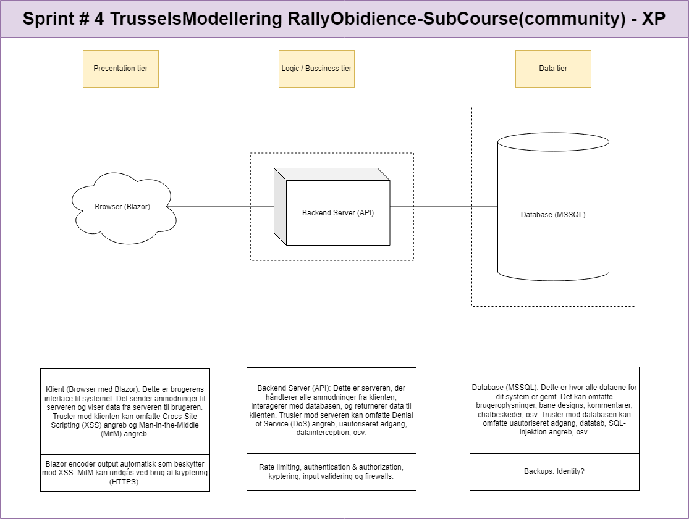

# Extream Programming

## Foranalyse / analyse af projektets situation / Projektstyring
Som en del af den løbende analyse af projektets situation, er følgende `Usikkerheder` og `Kompleksiteter` identificeret på nuværende tidspunkt i projektet.

- Projektet skal kunne håndtere flere brugere på en gang, tiltænkt teknologi til at løse dette i forbindelse med `live-shar af bane` er `SingalR`. Da udviklings teamet aldrig har arbejdet med singnalR før, er deres viden omkring implementering af dette ikke eksisterende og skal tilegnes undervejs.
- Projektet sjal have et login-system / funktionalitet, dette er på nuværende tidspunkt implementeret, således, at `data-laget` anvender `AspNetCore.Identity` og `AspNetCore.Identity.EntityFramworkCore`. Igen er udviklingsteamets viden begrænset da de ikke har arbejdet med login før. Derfor skal viden omkring implementeringen af dette tilegnes undervejs.
- projektets `front-end` del udvikles i `Blazor`. Igen er der første gang udviklingsteamet arbejder med Blazor og dermed endnu en ny teknologi, hvor viden skal tilegnes undervejs.
- projektet skal være et `distribueret-system`, da dette projekt er første gang udviklings teamets arbejder med distribueret systemer, skal viden om arkitekturen og ansvarsfordeling for de kommende sub systemer tilegnes undervejs.

### Usikkerheder
* Teknologier
    * SignalR
        * Hvad er signalR? - WebSocket
        * Hvordan implementeres signalR?
        * I hvilken kontekst anvendes signalR? - real-time web funktionaliteter
    * Identity on ASP.NET Core
        * Hvad er Identity? - Anvendes til login funktionaliteter
        * Hvor i den distribuerede arkitektur skal Identity implementeres? (Blazor, API eller Data - solution? er det et samspil imellem lagene).
    * JSON web Tokens - JWT
        * Hvordan sikres API'et bedst? - ved en token pr. user? eller andet ?
        * Hvordan kan JWT og Identity hænge sammen
    * Blazor
        * Hvad er Blazor?
        * Hosting og kommunikation med API ?

### Uklare Krav
* Hvilket `roller` skal have adgang til hvilket funktionaliteter?
* Skal der være en Admin rolle og hvad skal denne anvendes til`
    * Tilføje nye useres?
    * Tildele roller til eksisterende users?
    * Gendannelse af baner hvis de bliver slettet ved et uheld?

### Kompleksiteter
* Flere brugere
    * Forskellige roller
    * Forskellig brug og formål med systemet
    * mange scenarier der berør klasserne `Course` og `User`
* Integrationer/hosting
    * Kommunikation mellem
        * Data-solution - Skolens VPN og server
        * API - Azure (brugen af JWT)
        * Blazor - ??

### Samlet vurdering af Usikkerheder og Kompleksiteter
Projektet befinder sig i en situation hvor der er `høj-usikkerhed` og `mellem til høj - kompleksitet`.

### Valg af procesmodel

På baggrund af analysen af projektets situation vælges Cyklisk-Inkrementel
Derudover egner Cyklisk-inkrementel sig godt til refaktorering af eksisterende implementeringer.

Valget af procesmodel handler om at afdække behovet for at kunne håndtere de usikkerheder og kompleksiteter, der er i vores projekt. Sagt på en anden måde, handler valget af procesmodel om at facilitere de bedste rammer for risikostyring. Nedenstående tabel viser ud fra en ”tommelfinger-regle” hver af procesmodellerne og hvilket omfang af hhv. kompleksitet og usikkerheder de er egnet til at håndtere.

| Procesmodel                | Kompleksitet | Usikkerheder    |
|----------------------------|--------------|-----------------|
| Klassisk vandfald         | Lav          | Lav             |
| Vandfald med overlap eller feedback | Mellem  | Lav             |
| Inkrementel vandfald      | Høj          | Lav             |
| Cyklisk inkrementel       | Mellem       | Mellem-Høj      |
| Iterativ                  | Lav-mellem   | Mellem-Høj      |
| Agil                       | Lav          | Høj             |
| SOS                        | Høj          | Høj             |

### Valg af systemudviklingsmetode
Extrem Programming - XP

Da der er identificeret flere problemer/fejl/kommende ændringer til den eksisterende implementering fra FDD og i samspil med projektets situation, vurderes en TDD-tilgang passende (test-driven-development). Derudover fokusere XP på at udvikle en ting af gangen til full-fidelity og omfavner ændringer, som håndteres inden næste nye ting påbegyndes.

Der vurderes en god sammenhæng mellem Cyklisk-inkrementel og XP.

### Planlægning 
Prioriteret plan:

* CreateCourse - refactor
* CreateCourseByRegulations - refactor
* ShareCourse - refactor
* CollaborationOnCourse - new
* CommentCourse - new
* Chat - new

Github Kanban, RoadMap med milepæle

### Milepæle
* Estimeret slut = 24-5-2024
* Milepæl 5-5-2024 - CreateCours og ShareCourse
* Milepæl 12-5-2024 CreateCourseByRegulations - CollaborationOnCourse
* Milepæl 19-5-2024 login/Security/deployment/hosting
* Milepæl 24-5-2024 Finishing touch ??

## Opdateret DM
I forbindelse med skiftet til XP og de mange refatorerings opgavet, har teamet opdateret DM som en del af den løbende analyse.
Yderligere har teamet valg at nedfælde en mere uddybende forklaring af hver `konceptuel-klasse` for at alle i teamet er `attuned`.
Der kan argumenteres for, at denne uddybende forklaring også kan være med til at skabe klarhed om ansvarsfordelingen igennem systemet.

### Opdateret DM - XP
<figure markdown="span">
  { width="800" }
</figure>

### Uddybende forklaring af konceptuelle klasser
<figure markdown="span">
  { width="800" }
</figure>

## Tilføjelser i forbindelse med XP {#tilføjelse-ved-xp}
Teamet har tilegnet sig ny viden som projektet er skredet frem og har på baggrund af dette, forsøgt at identificere nogle `abuse-cases`.
Derudover er en overordnet `system-arkitektur` opstillet, så [TrusselsModellering](teknologi.md#trusselsmodellering) er muligt.
Se også [risikoanalyse](teknologi.md#teknologi-Risikoanalyse) som er den del af trusselsmodellering, for at kunne prioritere de identificerede trsuler / sikkerhedskrav.

### Abuse-cases

<figure markdown="span">
  { width="800" }
</figure>

### Overordnet system arkitektur
Læs mere om tankerne bag den overordnede system arkitektur [her](programmering.md#overordnet-arkitektur)

<figure markdown="span">
  { width="800" }
</figure>

