# Feature Driven Development

## An overall model {#An-overall-model}
Her defineres det overodnede `scope` for `Rally Obedience` projektet. Dette er både en del a best pratices og Stage 1 når FDD anvendes som systemudviklingsmetode.

En systemudviklingsmetode består af en række sammenhængende teknikker, der hver især udføres ved hjælp af et eller flere værktøjer. En teknik er en generisk beskrivelse af aktiviteter, samt målet med denne aktivitet. Et værktøj er en specifik angivelse af hvad man vil benytte for at udfører aktiviteten i teknikken. For at sikre sammenhængen mellem teknikkerne i metoden, bliver `outputtet` fra den ene teknik anvendt som `input` til den næste teknik.

An overall model - som teknik:

*   Formål: 
    * At skabe en fællesforståelse ramme for udviklingsteamet.
    * At skabe en overordnet domæne model.
    * At identificere systemkrav til at skabe en `Feature List`.
    * At identificere interessenter/`stackholders`.
*   Værktøjer:
    * Use Cases - `UC`
    * Use Case Diagram - `UCD`
    * Objektmodel - `OM`
    * Domænemodel - `DM`
    * Business Case - `BC`
*   Output:
    * Opnå viden om emner listet under formål
    * At kunne skabe en [Feature List](featureDrivenDevelopment.md#feature-list) når overall model er færdig.

### Use Cases - UC {#Use-case-fdd}
**Bane-system**

<figure markdown="span">
  { width="600" }
</figure>
<figure markdown="span">
  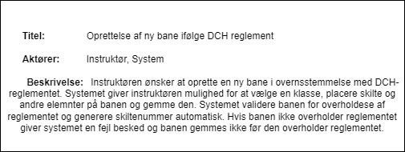{ width="600" }
</figure>
<figure markdown="span">
  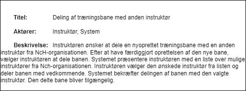{ width="600" }
</figure>
<figure markdown="span">
  { width="600" }
</figure>
<figure markdown="span">
  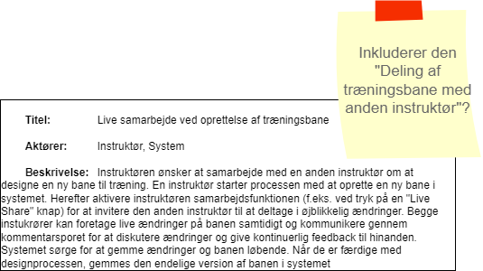{ width="600" }
</figure>

**Chat-system**
<figure markdown="span">
  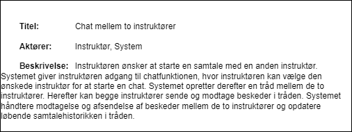{ width="600" }
</figure>
<figure markdown="span">
  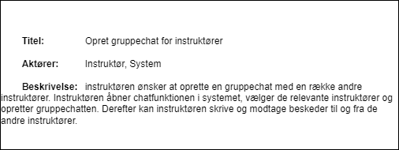{ width="600" }
</figure>
<figure markdown="span">
  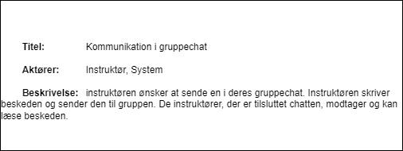{ width="600" }
</figure>

---

### Use Case Diagram - UCD {#Use-case-diagram-fdd}
Notationsformer i Use Case diagrammet:

- **Aktør** - Aktører repræsenteres med stick-figurer.
- **Use Case** - reprøsenteres med ellipser.
- **System Boundary** - Systemgrænsen er en boks, der omgriveuse cases for at angive systemets omfang.

Relationer mellem Use Cases:

- **Inklusion** - Etiketten `<<include>>` - Bruges, når en use case inkludere (kalder) en anden use case for at udfører en del af dens funktionalitet. Repræsenteres med en solid linje med en trekantet pil, der peger mod den inkluderede use case.
- **Udvidelse** - Etiketten `<<extend>>` - Bruges, når en use case kan udvides (optionelt) med ekstra funktionalitet under visse betingelser. Repræsenteres med en stiplet linje med en åben trekantet pil, der peger mod den udvidede use case.
- **Association** - Bruges til at vise en almindelig forbindelse eller relation mellem to use cases. Repræsenteres med en simpel linje uden nogen markører eller etiketter.

Notation for Pile:

- **Solid linje** - Bruges til at repræsentere direktet forbindelser eller inklusioner.
- **Stiplet linje** - Bruges til at repræsentet valgfri forbindelser eller udvidelser. 

<figure markdown="span">
  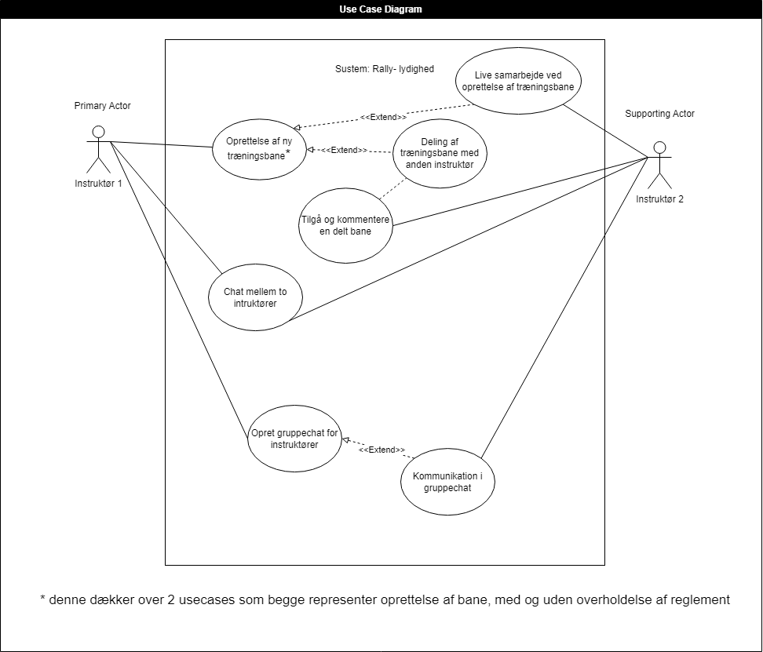{ width="800" }
</figure>

---
### Objekt Modeller - OM {#om-fdd}
Som tidligere beskrevet i [foranalyse 1 iteration](systemudvikling.md#Foranalyse1.iteration) kan systemet deles op i to sub-systemer `bane-system` og `chat-system`.

#### OM Chat-system
Nedenstående viser første iteration af chat-systemets OM. Da selve chat funktionaliteterne ikke har haft særlig høj prioritet fra PO's side, se den prioriteret [Feature List her](featureDrivenDevelopment.md#feature-list). Findes der i skrivende stund (05-05-2024) kun denne udgave af chat-systemets OM.

<figure markdown="span">
  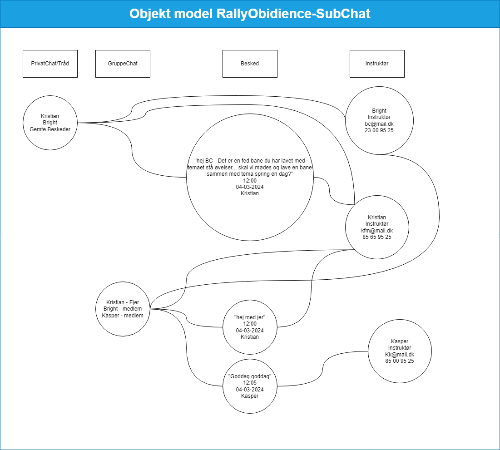{ width="800" }
</figure>

#### OM Bane-system
Da selve bane funktionaliteterne har haft høj prioritet fra PO's side, er der itereraret hen over denne OM i forbindelse med de forskellige sprints udviklingsteamet har haft. Hvor den første iteration skal ses som værende en del af `An overall model` og derfor har været med til at skabe den fælles forståelsesramme for udviklingsteamet.

Se afsnittet [Developing by features](featureDrivenDevelopment.md#Developing-by-feature) for hvordan nedenstående OM tilpasse/ændres undervejs i udviklingsprocessen.

#### 1. iterations OM Bane-system {#1iteration-om-fdd}

<figure markdown="span">
  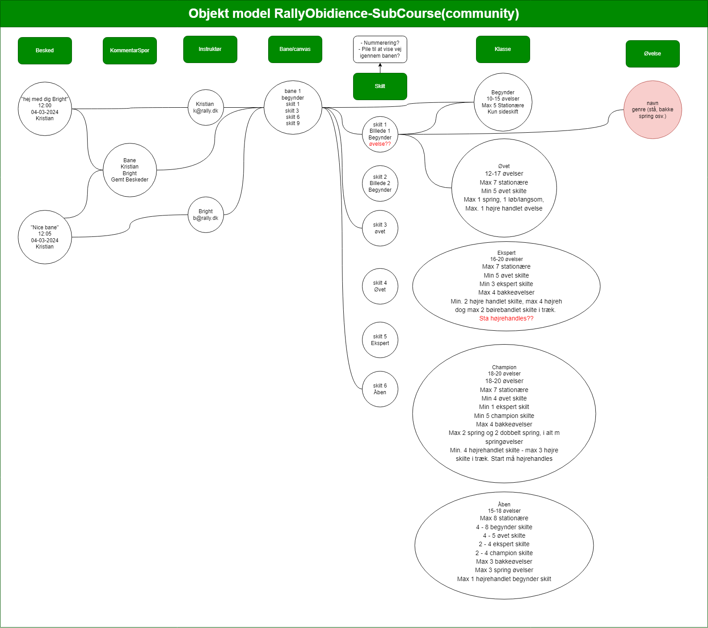{ width="800" }
</figure>

---
### Domæne Modeller - DM {#dm-fdd}
Ud fra de to OM's er følgende to DM's udfærdiget. 

#### DM Chat-system
Som tidligere beskrevet er Chat-systemet ikke videreudviklet under arbejdet med FDD, da disse funktionaliteter har haft lavere prioritet.
Derfor er denne DM's formål blot at være en del af `An-overall-model` og den er med til at skabe den fælles forståelses ramme for udviklingsteamet.
Denne DM vil blive refactoreret i en videre udviklingsproces, når udviklingen af chat funktionaliteterne påbegyndes. 

<figure markdown="span">
  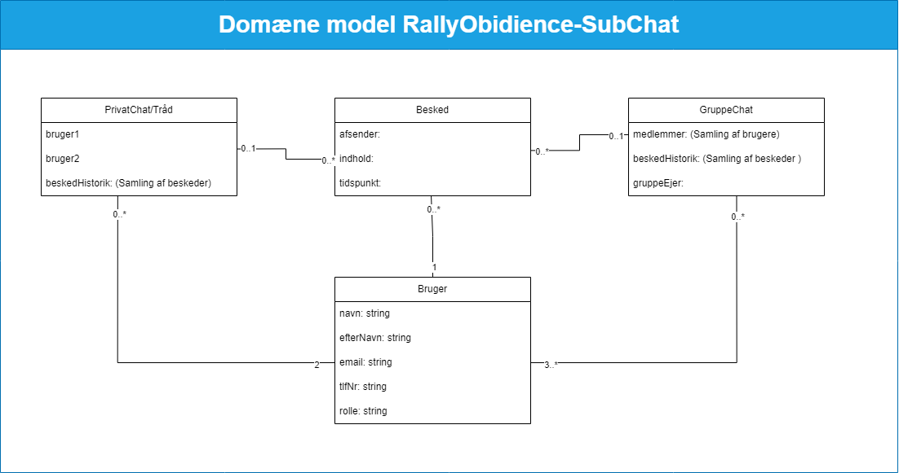{ width="800" }
</figure>

#### 1. iterations DM Bane-system
Denne DM har lige som [OM bane-system](featureDrivenDevelopment.md#1iteration-om-fdd) været itereraret hen over flere gange i forbindelse med [Developing by features](featureDrivenDevelopment.md#Developing-by-feature). Derfor kan denne `1. iterations DM Bane-system` ses som værende en del af `an-overall-model` og den har haft til formål at skabe den fælles forståelse ramme for udviklingsteamet inden selve udviklingsprocessen påbegyndes.

<figure markdown="span">
  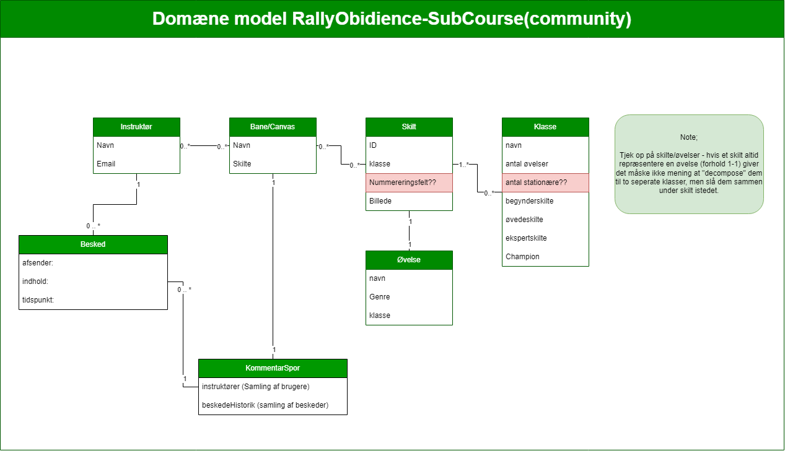{ width="800" }
</figure>

---

## Feature list {#feature-list}
Igennem problemstillingen ved [BusinessCase](systemudvikling.md#Businesscase) er der defineret en række features, der kan opfylde NcHs behov.
På baggrund af denne businesscase, er der udfærdiget en række [use cases](featureDrivenDevelopment.md#Use-case-fdd) og deres sammenhæng/relationer er defineret og illustreret i [use case diagrammet](featureDrivenDevelopment.md#Use-case-diagram-fdd).
De definerede features og deres sammenhæng illusteret gennem use case og use case diagrammet fungere som hjælpende værktøjer til at prioritere features.
Feature listen er blevet prioriteret på et møde med PO. Denne prioriterede feature list vil fungere som udviklingsteamets `Backlog`.

Listen i prioriteret rækkefølge:

| Opret trænings bane | klik på opret bane --> klik på til træning --> |
| ----------- | ----------- |
| Feature | Viser en tom template. |
| Feature | Vise alle skilte og elementer (kegler, pile med betydning som gå i ring mm.). |
| Feature | Trække og slippe skilte og andre elementer ind i som udgør bane designet. |
| Feature | Systemet generer automatisk skilte numre "på banen". |
| Feature | Systemet genere automatisk en tabel med skilterækkefølgen og deres ID |
| Feature | Systemet generer automatisk pile som viser vejen gennem banen. |

| Opret bane til reglement | klik på opret bane --> klik på efter reglement--> Vælg klasse banen skal være til --> |
| ----------- | ----------- |
| Feature | Viser en tom template. |
| Feature | Vise alle skilte og elementer (kegler, pile med betydning som gå i ring mm.) til den valgte klasse. |
| Feature | Systemet validere antal skilte, rækkefølgen af skilte ift. reglement |
| Feature | Systemet generer automatisk skilte numre "på banen". |
| Feature | Systemet genere automatisk en tabel med skilterækkefølgen og deres ID |
| Feature | Systemet generer automatisk pile som viser vejen gennem banen. |

| Deling af træningsbane med anden instruktør | klik på del bane --> |
| ----------- | ----------- |
| Feature | Viser en liste med alle instruktører |
| Feature | Del knap - systemet håndtere/opretter associationer |
| Feature | En notifikationer om en bane er blevet del med dig |

| Tilgå og kommentere en delt bane | klik på baner --> Delte baner |
| ----------- | ----------- |
| Feature | Viser en liste med alle baner der er delt med useren (instruktøren). |
| Feature | en valgte bane vises. |
| Feature | En notifikationer om en bane er blevet del med dig |
| Feature | Tilføje en kommentar til banen. |
| Feature | Vise kommentar historikken i et kommentarspor. |	

| Live samarbejde ved oprettelse af træningsbane | Klik på opret bane --> klik på til træning --> |
| ----------- | ----------- |
| Feature | Viser en tom template. |
| Feature | Viser alle skilte og elementer (kegler, pile med betydning som gå i ring mm.). |
| Feature | Viser en "Live share" knap. |
| Feature | Systemet skal kunne håndtere RealTime samarbejde mellem to users (muligvis gennem et link der bliver delt) |

| Chat mellem to instruktører | Klik på Instruktører --> Vælg instruktør --> Klik start chat |
| ----------- | ----------- |
| Feature | Liste over instruktør |
| Feature | Vælg start chat med en instruktør |
| Feature | Vis tom chat vindue |
| Feature | Skriv besked |
| Feature | Send besked |
| Feature | Chat historik bliver gemt |
| Feature | Slet en besked - systemet skal kunne fjerne en besked fra visningen (måske skal den gemmes i en log - sikkerhed). |
| Feature | Rediger en besked - systemet skal kunne håndtere at en user ønsker at redigere i sin egen allerede postede besked. |

| Chat mellem to instruktører | Klik på Instruktører --> Vælg instruktør --> Klik start chat |
| ----------- | ----------- |
| Feature | Liste over instruktører |
| Feature | Vælg start chat med en instruktør |
| Feature | Vis tom chat vindue |
| Feature | Skriv besked |
| Feature | Send besked |
| Feature | Chat historik bliver gemt |
| Feature | Slet en besked - systemet skal kunne fjerne en besked fra visningen (måske skal den gemmes i en log - sikkerhed) |
| Feature | Rediger en besked - systemet skal kunne håndtere at en bruger ønsker at redigere i sin egen allerede postede besked |

| Opret gruppechat for instruktører | |
| ----------- | ----------- |
| Feature | Viser en liste med alle instruktører |
| Feature | Systemet tilknytter en bruger til den oprettede gruppe |
| Feature | Tilføj bruger efter gruppechatten er oprettet |
| Feature | Forlad gruppen |
| Feature | Slet gruppechat |
| Feature | Visning over alle medlemmer af gruppechatten |
| Feature | Visning over alle "mine" grupper |
| Feature | Viser et tekstfelt til oprettelse af besked |
| Feature | Send/post besked - systemet gemmer beskeden, så den er synlig for de andre medlemmer af gruppen |
| Feature | Systemet viser beskedhistorikken, så der er styr på hvem der skrev hvad hvornår i visningen af alle beskeder |
| Feature | Slet en besked - systemet skal kunne fjerne en besked fra visningen (måske skal den gemmes i en log - sikkerhed) |
| Feature | Rediger en besked - systemet skal kunne håndtere at en bruger ønsker at redigere i sin egen allerede postede besked |

| Kommunikation i gruppechat | |
| ----------- | ----------- |
| Feature | Der skal være et tekstfelt, hvor der kan skrives en besked |
| Feature | Der skal være en 'send knap' som sender teksten i tekstfeltet til modtagerne |
| Feature | Der skal være en feedback der viser at modtagerne har modtaget beskeden, og når modtagerne har læst beskeden |
| Feature | Der skal være mulighed for at redigere eller slette en tidligere besked eller tekst |
| Feature | Der skal være mulighed for at svare direkte på en besked i chatten |
| Feature | Der skal være en visning af hvem der er afsender på de enkelte beskeder |
| Feature | Der skal være 'time stamps' på alle de beskeder der bliver sendt |

---

## Developing by features {#Developing-by-feature}
Den overordnede plan for at følge denne `Best pratices in FDD` er forsøgt illustreret på nedenstående billede.

<figure markdown="span">
  { width="600" }
</figure>

Her skal der særligt lægges vægt på Stages 3-5. Hvor mening var for hver `Feature` som har en tilhørende `Use Case` skulle der udfærdiges 

* Systemsekvensdiagram - `SSD`
* Sekvensdiagram - `SD`
* operationskontrakt - `OC`

Dernæst kunne OM og DM fra `An-overall-model` opdateres så den fælles forståelsesramme for udviklingsteamet altid var `Aligned`.

Men som det tydligt fremgår af nedenstående artefaktor lykkedes det ikke udviklingsteamet at følge denne plan. Dette vurderes at skyldes `Usikkerheder` og `Kompleksiteter` i projektet som udviklingsteamet ikke var opmærksomme på ved opstarten af projektet og valget af FDD. Læs mere om dette i refleksionsafsnittet [her](systemudvikling.md#relections-on-fdd).

### 2. iterations OM og DM Bane-system

<figure markdown="span">
  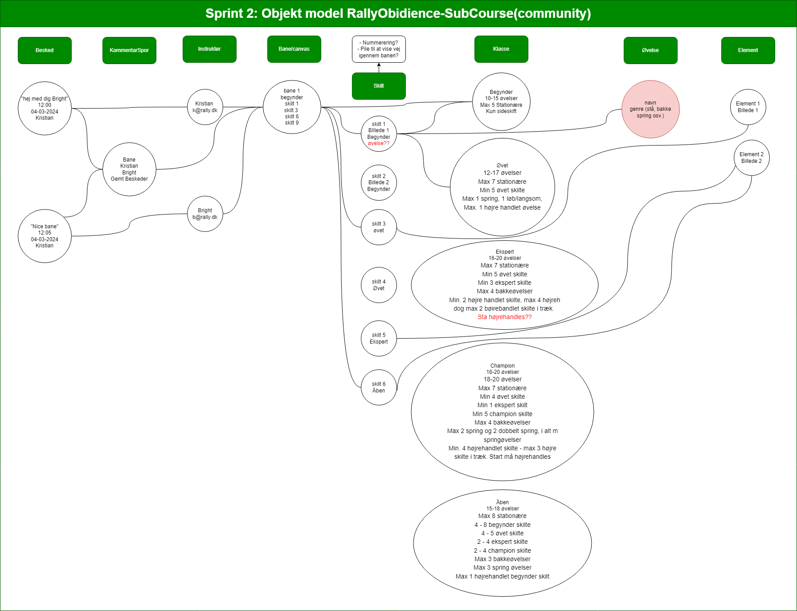{ width="800" }
</figure>

<figure markdown="span">
  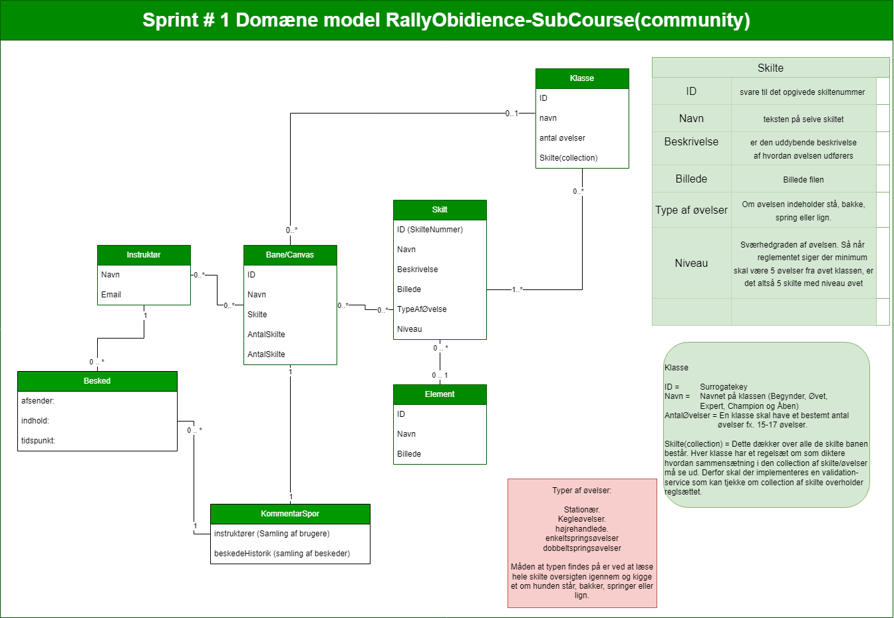{ width="800" }
</figure>

### 3. iterations DM Bane-system

<figure markdown="span">
  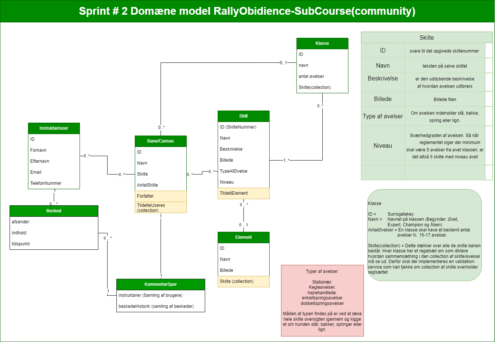{ width="800" }
</figure>

---

## Component/Class ownership {#Component-class-ownership}
Beskriver hvordan vi har tildelt ansvaret for bestemte features til mindre teams. Nævn gerne brugen af `github Kanban eller nogle af de andre` og vores Assignet TO: ... Husk at beskriv hvordan vi anvender `Feature Teams`, lige som har delt os op i grupperne, hvor BC og KFM har feature alle skilte og JJ og KKN har vis en tom bane.

## Inspctions and quality assurance {#inspections}
Beskriv vores Kvalitetssikrings protokoller og aktiviteter. Beskriv hvordan vi til vores gruppemøder har afholdt peer-reviewa mellem de to mindre feature-teams.

## Visibility of progress {#visibility-of-progress}
beskriv brugen af milepæle `(milestones i github)`. Indsær gerne billeder af milepæle.
lave et roademap sorteret på milepæle og indsæt billede også.

## Plan by feature {#plan-by-feature}
Denne `stage` i FDD, omhandler projektstyring. Projektstyring er også et af de 7 fokusområder en systemudviklingsmetode helst skal dække. 

Hvis man anskuer fokusområdet projektstyring indeholder det følgende:

* Projektbrief
* Foranalyse
* Valg af procesmodel
* Valg af systemudviklingsmetode
* Planlægning af tid, ressourcer og kommunikation
* Løbende analyse af projektets situation
* Tilpasning af systemudviklingsmetode og procesmodel

Oftest er der en tendesn til at projektstyring for mest fokus i opstarten af et projekt og derefter forsvinder fokus væk fra projektstyring og der kan hurtigt opleves at projektets plan skrider. Derfor er det vigtigt at have fokus på `Proaktiv projektstyring`.

Proaktiv projektstyring indebærer at opdatere de fortagede analyser, så de reflektere projektets aktuelle situation. Herigennem kan de udfordringer, teamet står overfor identificeres, hvis disse udfordringer ikke kan afviges, kan teamet træffe foranstaltninger til at afbøde konsekvenserne.

### Projektbrief
I team 2s proces med FDD, er der udfærdiget en [BusinessCase](systemudvikling.md#Businesscase). Der udover er der udfærdiget et [Project Scope Description](Scope.md). Disse to tilsammen udgøre `Projektbrief` for team 2.

### Foranalyse
Den udfærdiget [Foranalysen](systemudvikling.md#Foranalyse1.iteration) før valget af systemudviklingmetoden FDD er beskrevet tidligere.

### Valg af procesmodel
Der kan argumenteres for at dette valg ikke har været præcist nok i forbindelse med arbejdet med systemudviklingsmetoden FDD. Der er overordnet arbejde ud fra en cyklisk procesmodel. Mere om dette kan findes i [Reflskioner om FDD](systemudvikling.md#reflections-on-fdd)

### Valg af systemudviklingsmetode
Valget af FDD var fortaget på baggrund af interesse fra team 2 side. Da FDD blev præsenteret og Team 2 læste mere om denne, lød den spænende og det med at identificere og udvælge enkelte features, implementere disse og udvide der fra lød passende ift. projektet. Men da valget af denne ikke har været nok baseret på projektet situation, usikkerheder og kompleksiteter forbundet med projektet er der også valgt at skifte systemudviklings metode til Extream Programming XP. Mere om dette kan findes i [Reflskioner om FDD](systemudvikling.md#reflections-on-fdd)

### Planlægning af tid, ressourcer og kommunikation

<figure markdown="span">
  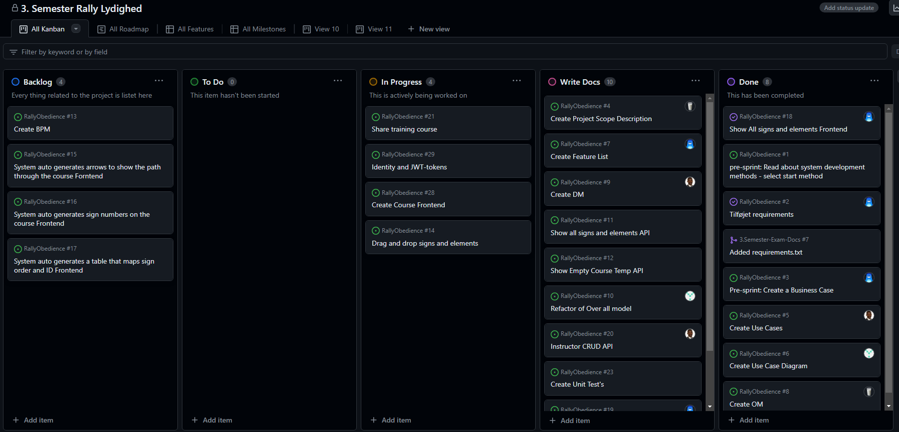{ width="800" }
</figure>

---

## Design by feature {#design-by-feature}
Beskriv hvordan vores design proces af hver feature forgår i overordnede træk.
Lav en under oversskrift med den feature du arbejder på, og dokumenter den her. Husk at indsætte billeder eller lign. af evt. artefakter der er anvendt.