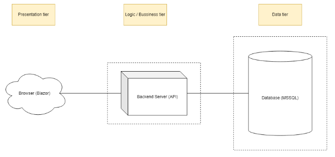
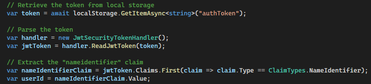

# Programmering
---

## Et distribueret system
Distribuerede systemer er en samling af autonome computerenheder, der samarbejder for at opnå et følles mål. Disse systemer er kendetegnet ved:

* Deres komponenter er geografisk adskilte
* Komponenterne kommunikere over netværk
    * Protokoller som HTTP/HTTPS, TCP/IP
* Ressoucer deles og opgaver kan fordeles mellem flere computere, hvilket forvedre både ydeevne og pålidelighed
    * Fejlrolerance: Systemet kan fortsætte med at fungere korrekt, selvom en eller flere komponenter fejler.


### Overordnet arkitektur {#overordnet-arkitektur}

Arkitekturen i projekt `RallyObedience` kan beskrives i termer af lagdelt arkitektur, som typisk opdeles i præsentationslag, forretninglogiklag og datalag.

<figure markdown="span">
  { width="800" }
</figure>

**Præsentationslag: Frontend Blazor**
Dette lag er ansvarlig for at inteagere med brugeren. Det viser brugergrænsefladen og sender brugerens input videre til backend-tjenesterne.

* Komponent: `rally-blazor`
* Funktion: Viser data til brugeren og sender brugerens input som HTTP-request til API'en

**Forretningslogiklag: API og Dataadgang Backend**
Dette lag håndtere applikationens kernefunktionalitet. Det modtager `requests` fra præsentationslaget, nehnadler forretningslogik gennem implementerede `controllers` og `services` og kommunikere med datalaget.

* Komponent: `rally-webapi`
* Funktion: Behandler forretningslogi og regler, validere input, udfører beregninger og sender `requests` til datalaget.

**Datalag: Database MSSQL**
Dette lag er ansvarlig for at gemme og hente data. Det modtager `requests` fra forretningslogiklaget og sender `respons` med de nødvendige data retur.

* Komponent: sqlpreview
* Funktion: Håndtere lagring, hentning og administration af data.

#### Samspil mellem lagene

1. Præsentaionslager: Brugeren interagere med Blazor-applikationen, som sender en HTTP-anmodning til API'en for at udfører en given funktionalitet (f.eks. valider bane med id x ud fra niveau begynder).
2. Forretningslogiklag: API'en modtager anmodningen `controlleren`, behandler forretningslogikken `services`. Og sender en SQL-forespørgsel til databasen gennem `repo`.
3. Datalag: MSSQL-databasen udfører forespørgslen og returnere resultatet til API'en (information om bane med id-x).
4. Forretninglogiklaget: API'en behnadler de modtagne data og sender et svar tilbage til Blazor-applikationen.
5. Præsentationslag: Blazor-applikationen modtager svaret og viser dataene til brugeren (udfører et validerings tjek på banens information, om dens collection af skilter overholder reglementet for niveau begynder og returnere en besked med information om hvad den mangler for at opfylde eller OK - den er valideret).

Ved at opdele systemet i disse lag forsøge der at opnå klar `separation of concerns`, hvilket gør det lettere at udvikle, vedligholde og skalere systemet.


#### Hvordan Containerization Illustere Vores Distribuerede System {#vores-brug-af-docker}
I projekt `RallyObedience` har vi anvendt `Docker` til at containerisere tre hovedkomponenter:

1. Frontend - Blazor
2. API og Dataadgang
3. Database

Hver af disse komponenter kører i sin egen container, hvilket giver flere fordele:

* Frontend Blazor Container:
    * Indeholder vores Blazor applikation, som præsentere brugergrænsefladen
* API og Data Container:
    * Indeholder vores backend API, som håndtere forretningslogi og dataadgang
* Database Container:
    * Indeholder vores MSSQL database, som gemmer alle data for systemet

Ved at kører hver komponent i sin egen container sikrer vi isolering og uafhængighed mellem dem. Dette gør det lettere at udvikle, teste og deployere hver komponent separat. Desuden kan vi hurtigt oprette nye miljøer eller skalere individuelle komponenter efter behov.
læs mere om [containerization](teknologi.md#teknologi-containerization) på teknologisiden.

#### Docker files og Docker Compose

Ved at bruge Docker files og Docker Compose kan vi definere og køre vores distribuerede systm som et sæt af sammenhængende tjenester `(Multicontainer applikation)`, hvilket gør det nemt at opsætte og administrer miljøet.

Blazor Docker File
```
FROM mcr.microsoft.com/dotnet/aspnet:8.0 AS base
WORKDIR /app
EXPOSE 8080
EXPOSE 8081

FROM mcr.microsoft.com/dotnet/sdk:8.0 AS build
ARG BUILD_CONFIGURATION=Release
WORKDIR /src
COPY ["RallyObedience.Blazor/RallyObedience.Blazor.csproj", "RallyObedience.Blazor/"]
RUN dotnet restore "./RallyObedience.Blazor/RallyObedience.Blazor.csproj"
COPY . .
WORKDIR "/src/RallyObedience.Blazor"
RUN dotnet build "./RallyObedience.Blazor.csproj" -c $BUILD_CONFIGURATION -o /app/build

FROM build AS publish
ARG BUILD_CONFIGURATION=Release
RUN dotnet publish "./RallyObedience.Blazor.csproj" -c $BUILD_CONFIGURATION -o /app/publish /p:UseAppHost=false

FROM base AS final
WORKDIR /app
COPY --from=publish /app/publish .
ENTRYPOINT ["dotnet", "RallyObedience.Blazor.dll"]
```

API og Data Docker File
```
FROM mcr.microsoft.com/dotnet/sdk:8.0 AS build
WORKDIR /src
COPY ["RallyObedienceCourse.API/RallyObedienceCourse.API.csproj", "RallyObedienceCourse.API/"]
COPY ["RallyObedience.Data/RallyObedience.Data.csproj", "RallyObedience.Data/"]
RUN dotnet restore "RallyObedienceCourse.API/RallyObedienceCourse.API.csproj"
COPY . .
WORKDIR "/src/RallyObedienceCourse.API"
RUN dotnet build "RallyObedienceCourse.API.csproj" -c Release -o /app/build
RUN dotnet publish "RallyObedienceCourse.API.csproj" -c Release -o /app/publish /p:UseAppHost=false

FROM mcr.microsoft.com/dotnet/aspnet:8.0 AS final
WORKDIR /app
COPY --from=build /app/publish .
ENTRYPOINT ["dotnet", "RallyObedienceCourse.API.dll"]
```

Docker Compose File:<br>
*bemærk at der i denne visning er maskeret vigtige inputs ved brug af `${}` notationsformen*
Hvis du rent faktisk skal stukturer din Docker compose fil på denne måde og ikke indsætte væriderne direkte skal der oprettes en `.env` - fil som tillader brugen af miljøvariabler. Denne skal placeres i samme mappe som din `docker-compose`-fil og definere variablerne der.

```
version: '3.8'

services:
  sqlpreview:
    image: mcr.microsoft.com/mssql/server:2022-preview-ubuntu-22.04
    environment:
      - ACCEPT_EULA=Y
      - MSSQL_SA_PASSWORD=${MSSQL_SA_PASSWORD}
      - MSSQL_PID=Evaluation
    ports:
      - "1433:1433"

  rally-webapi:
    image: rally-webapi:latest
    environment:
      - ConnectionStrings__connectionDev=Server=sqlpreview,1433;Database=${DATABASE_NAME};User Id=${DB_USER};Password=${DB_PASSWORD};Trusted_Connection=True;MultipleActiveResultSets=True;
    ports:
      - "8080:80"
    depends_on:
      - sqlpreview

  rally-blazor:
    image: rally-blazor:latest
    environment:
      - ASPNETCORE_URLS=http://+:80
    ports:
      - "5000:80"
    depends_on:
      - rally-webapi
```

**Forklaring af docker compose**

* sqlpreview:
    * Denne container kører en MSSQL databse. Miljøvariabler bruges til at konfigurer databasen, og port 1433 eksporneres for adgang.
* rally-webapi:
    * denne container kører API'en. Den er afhænig af `sqlreview` containeren for databaseadgang. Miljøvariabler bruges til at konfigurere databaseforbindelsen, og port 8080 eksporneres for adgang.
* rally-blazor:
    * Denne container kører Blazor frontend applikationen. Den er afhæning af `rally-webapi` container for at kunne kommunikere med backend API'en. Port 5000 eksporneres for adgang.

### Blazor
Under projektet blazor ligger alt frontend koden.

### Data
I projektet <b>data</b> er data-laget. Der ligger alt forbindelse til databasen.
<br/>
I mappen <b>entities</b>, indholder den alle de klasser, der bliver brugt til at lave migrations til databasen.
Herigennem er der også C# attributes, for eks. at fortælle databasen om der er tale om en Primary key eller ForeignKey
<br/>
```
[Key]
public int Id { get; set; }
...
[ForeignKey("Creator")]
public string CreatorId { get; set; }
```
Disse relationer får betydning, når tabeller bliver oprettet i databasen.

I mappen <b>DbContexts</b> finder vi context til databasen.
Vi ser først at ROContext arver fra IdentityDbContext:<br/>
`public class ROContext : IdentityDbContext<User>` 
<br/>
Det betyder at der er brugt ASP.NET Cores metode for at oprette og autorisere brugere.
<br/><br/>
Herefter ser vi nogle properties, hvor de forskellige tables bliver sat i databasen.<br/>
<i>De tabeller der bliver oprettet igennem Identity, er dog ikke vist her.</i>

```
public DbSet<Item> Items { get; set; }
public DbSet<Course> Courses { get; set; }
public DbSet<UserCourse> UserCourses { get; set; }
public DbSet<CourseItem> courseItems { get; set; }
```

Under metoden `protected override void OnModelCreating(ModelBuilder modelBuilder)`, bliver der oprettet alle de relationer, der i databasen imellem de forskellige tabeller. 
```
modelBuilder.Entity<UserCourse>()
    .HasOne(uc => uc.User)
    .WithMany(u => u.UserCourses)
    .HasForeignKey(utc => utc.UserId)
    .OnDelete(DeleteBehavior.Restrict);
```    
Her  oprettes der tabellen `UserCourse`. Tabellen har et one-to-many relationship.
Den tabel har en relation til én User med Mange UserCourses.
De er relateret hinanden igennem UserId.

Slutligt bliver der seedet data til databasen.
```             
modelBuilder.Entity<Item>()
.HasData(
new Item()
{
    Id = 1,
    Name = "Start",
    Description = "...",
},
....
```

#### Repositories
Under repositories, har vi de steder hvor vi sender vores metoder til databasen.
Det kunne f.eks være når vi skal have alle baner fra en bestemt user:

```
public async Task<List<Course>> GetAllCoursesByUserIdAsync(string userId)
{
    // Get all TrainingCourses by UserId from the database
    var courses = await _context.UserCourses
        .Where(utc => utc.UserId == userId)
        .Select(utc => utc.Course)
        .ToListAsync();

    return courses;
}
```

På den måde har vi seperation of concern, hvor vi delt vores kode op i mindre dele og vores metoder ikke overlapper hinanden.<br/>
Det gør det nemmere at vedligeholde, fejlfinde og teste.

## API: Opret bane (Backend) 
I API projektet er der hvor størstedelen logikken er samlet, og hvor der bliver lavet diverse kald til databasen.
<br/>
API projektet har følgende hovedmapper:
<br/><br/>
<b>Controllers:</b> I API laget er arkitekturen opsat ved at vi har en controller, dens rolle er at forbinde brugerens input med APIens business logic.
<br/><br/>
<b>Services: </b> For at indkapsle logikken er der oprettet services.
<br/><br/>
<b>Models / DTOs: </b> De forskellige klasser, brugerne har tilgang til, er oprettet sig DTOs.
<br/>
DTOs har også den fordel at de kan mappes til data klasser. Derved er der kontrol over, hvilke data vores brugere skal kunne se og ændre.
<br/><br/>
<b>MappingProfiles: </b> Her kan vi mappe DTOs til dataklasser.

#### Flowet for Opret Bane
Herunder vil der gennemgå hvordan der bliver oprettet en bane, igennem backend, fra når bruger trykker opret, til der bliver gemt i databasen.
<br/>
Det skal nævnes at frontend står for en række andre dele. Det kan læses i nedståede ["Oprettelse af kursus"](programmering.md#oprettelse-af-kursus)

<br/>
Når bruger klikker "Opret Bane", vil metoden `CreateEmptyCourse?` blive kaldt.

```
private async Task CreateEmptyCourse()
{
    ...

    apiEndPoint = Configuration.GetSection("APIEndpoint")["Url"];
    string apiUrl = $"{apiEndPoint}/api/course/create-course/{userId}";
    ...
}
```

Den metode vil kalde endpointet i API laget, i vores CourseController  `/api/course/create-course/{userId}`
```
[HttpPost("create-course/{userId}")]
public async Task<IActionResult> CreateCourse(string userId)
{
    var courseToReturn = await _courseService.CreateCourse(userId);
    
    if (courseToReturn == null) 
    {
        return BadRequest("Failed to create course or unauthorized access.");
    }

    return Ok(courseToReturn);
}
```
I overstående ses det at der er indsat en attribute `[HttpPost("create-course/{userId}")]`
Her bliver der fortalt at der bliver brugt af en HTTP POST method, og URi til det endpoint vi bruger.
Derudover så bliver den nuværendes bruger id, indsat som en parameter. Dette ID skal vi bruge til at oprette en bane.
<br/>
Derudover er metod async, og vi venter på metoden `CreateCourse` fra `courseService` på at blive færdig før vi fortsætter.
<br/>
Async er brugt, da der skal ventes på databasen om at blive færdig.
<br/>
Fra Controller kommer vi over til service laget, til `CreateCourse`:
```
public async Task<CourseDto> CreateCourse(string userID)
{
    
    var course = _courseRepo.CreateCourse(userID);
    if (course == null || course.Value.CreatorId == null)
    {
        return null;
    }

    if (userID != course.Value.CreatorId)
    {
        return null;
    }

    var userIds = new List<string> { userID };

    await _courseRepo.ShareCourseAsync(course.Value.Id, userIds);
    
    var courseDto = _mapper.Map<CourseDto>(course.Value);

    return courseDto;
}
```
Først forlader vi faktisk API laget og går over til Data laget til 'Repositories'. Som beskrevet tidligere, håndterer 'Repositories' kaldene til databasen.
<br/>
```
public ActionResult<Course> CreateCourse(string userId)
{    
    string name = $"Untitled Course";
    Course course = new Course 
    {
        Name = name,
        CreatorId = userId                
    };

    // Save the new TrainingCourse to the database
    _context.Courses.Add(course);
    _context.SaveChanges();
    return course;
}
```
Igennem her bliver der her sat at default navn: `string name = $"Untitled Course";`
<br/>
Og derefter bliver der instatieret et nye `Course` objekt, med det default navn og id'et på den bruger vi fik fra parameteret tilbage fra `CourseController`
<br/>
Denne bane bliver så oprettet i databasen i tabellen Course '_context.Courses.Add(course);'
<br/>
Slutligt bliver denne bane retureret tilbage til `CourseService` og vi kan kigge nærmere på næste skridt:
<br/>
```
if (course == null || course.Value.CreatorId == null)
{
    return null;
}
```
Her bliver der tjekket om der er sat en bane/course og om denne bane også har et `CreatorId` (Det er brugerns ID).
<br/>
Herfra bliver der oprettet en liste med `userIds`, listen her skal bruges til at dele banen.
<br/>
Første gang banen bliver oprettet er den delt med den bruger der har oprettet banen (Creator)
<br/>
Vi går igen ind til `CourseRepo` til metoden `ShareCourseAsync`
```
var userIds = new List<string> { userID };
await _courseRepo.ShareCourseAsync(course.Value.Id, userIds);
```
Først bliver der tjekket om banen existerer, og om alle brugere eksisterer og dernæst indsætter dem i tabellen `UserCourses`
```
public async Task<ActionResult> ShareCourseAsync(int courseId, List<string> userIds)
{
    try
    {
        // Find the course by ID
        var course = await _context.Courses.FindAsync(courseId);

        if (course == null)
        {
            return new NotFoundResult();
        }

        foreach (var userId in userIds)
        {
            // Check if the user exists
            var user = await _context.Users.FindAsync(userId);

            if (user == null)
            {
                // Handle invalid user ID
                continue;
            }

            // Add a new entry to the UserTrainingCourse table
            _context.UserCourses.Add(new UserCourse { UserId = userId, CourseId = courseId, CreatorId = course.CreatorId });
        }

        // Save changes to the database
        SaveChangesAsync();

        return new OkResult();
    }
    catch (Exception ex)
    {
        // Handle any exceptions and return an appropriate error response
        return new StatusCodeResult(500);
    }
}
```
Vi afventer at `await _courseRepo.ShareCourseAsync(course.Value.Id, userIds);` er færdig går vi videre til næste skridt i `CourseService``

```
var courseDto = _mapper.Map<CourseDto>(course.Value);
return courseDto;
```

Her mapper vi den oprettet `Course` til en `CourseDto` - Det er dén datatype vi returnerer til `CourseController`
<br/>
Den vil til sidst tjekke om `Course` er oprettet og give vores bruger besked på dette
```
if (courseToReturn == null) 
{
    return BadRequest("Failed to create course or unauthorized access.");
}

return Ok(courseToReturn);
```
Er banen oprettet vil der giver en status code 200, men de værdier, vi mappede fra `Course` til `CourseDto`, som samtidig vil blive serialized til JSON.
<br/>
Dette JSON objekt kan så bruges videre til at arbejde med frontend.

### Test

Igennem projektets [systemudviklingsmetoder](systemudvikling.md) er der blevet skrevet tests.
<br/>
Her vil vi gennemgå test for `CreateCourse`
```
public CourseControllerTests()
{
    _mockService = new Mock<ICourseService>();
    _mockMapper = new Mock<IMapper>();
    _controller = new CourseController(_mockService.Object, _mockMapper.Object);
}

[TestMethod]
public void CreateCourse_ShouldReturnCreatedCourse()
{
    // Arrange: Setup mock repository and test course
    var course = new CourseDto { Id = 1, Name = "Untitled Course", CourseItems = new List<CourseItemDto>() };
    var course1 = new CourseDto { Id = 1, Name = "Untitled Course", CourseItems = new List<CourseItemDto>() };

    _mockService.Setup(Service => Service.CreateCourse("1")).ReturnsAsync(course);

    // Act: Call CreateCourse method
    var result = _controller.CreateCourse("1");

    // Assert: Check if the returned course is as expected
    var okResult = result.Result as OkObjectResult;
    var returnValue = okResult.Value as CourseDto;
    Assert.AreEqual(course1.Id, returnValue.Id);
    Assert.AreEqual(course1.Name, returnValue.Name);
    Assert.AreEqual(course1.CourseItems.ToString(), returnValue.CourseItems.ToString());
}
```
Teamet har brugt samme struktur for alle test: Arrange, Act og Assert (AAA).
<br/><br/>
<b>Arrange:</b> Vi arranger dataen først ved at instatiere de objekter (`CourseDto`), der bliver returnet igenem den metode vi tester:
```
var course = new CourseDto { Id = 1, Name = "Untitled Course", CourseItems = new List<CourseItemDto>() };
var course1 = new CourseDto { Id = 1, Name = "Untitled Course", CourseItems = new List<CourseItemDto>() };
```

Under arrange bliver der også Mocking, så vores kode har de metoder der skal bruges.
`_mockService.Setup(Service => Service.CreateCourse("1")).ReturnsAsync(course);`

Her er der sagt at `CreateCourse` er en del af interfacet `iCourseService`, som set i constructor.
Derudover at vi vil køre metoden `CreateCourse` med id = 1, som parameter.
<br/><br/>
<b>Act: </b> Der bliver arrageret som den metoden, der skal testes: `CreateCourse` fra `CourseController` og vi gemmer det i en variabel:
<br/>
`var result = _controller.CreateCourse("1");`
<br/><br/>
<b>Assert:</b> Til sidst kan vi se om der bliver returneret det vi forventer:
```
var okResult = result.Result as OkObjectResult;
var returnValue = okResult.Value as CourseDto;
Assert.AreEqual(course1.Id, returnValue.Id);
Assert.AreEqual(course1.Name, returnValue.Name);
Assert.AreEqual(course1.CourseItems.ToString(), returnValue.CourseItems.ToString());
```
Vi forventer først at der bliver returneret et HTTP response 200 og vi får `CourseDto` data.
<br/>
I den CourseDto data, skal id'et være det samme som `course1.id`
<br/>
Det samme gælder navnet og den tomme `CourseItems` liste.

---

# Oprettelse af bane

For at oprette et kursus i vores system, skal brugeren først registrere sig og logge ind. Dette er nødvendigt for at sikre, at kun autoriserede brugere kan oprette kurser.

## Registrering

For at registrere, skal brugeren udfylde en formular med følgende felter:

- Fornavn
- Efternavn
- Brugernavn
- Adgangskode

Når formularen er udfyldt, sendes dataen til vores backend via en HTTP POST-anmodning til `/api/Auth/Register` endpointet.

## Login

Efter registrering kan brugeren logge ind ved at indtaste deres brugernavn og adgangskode i login-formularen. Disse oplysninger sendes til vores backend via en HTTP POST-anmodning til `/api/Auth/Login` endpointet. Hvis login er succesfuldt, returnerer backenden en token, som gemmes i lokal lagring for senere brug.

## Oprettelse af kursus

Når brugeren er logget ind, kan de oprette et nyt kursus ved at klikke på "Opret bane" knappen. Dette udløser en HTTP POST-anmodning til `/api/course/create-course/{userId}` endpointet, hvor `{userId}` er brugerens unikke ID. Hvis oprettelsen er succesfuld, returnerer backenden detaljerne for det nyoprettede kursus.

## Ekstraktion af userId fra Token

Når en bruger logger ind, genererer vores backend en token, som indeholder brugerens unikke ID (`userId`). Dette `userId` er indlejret i token som en af dens claims.

Når vi skal oprette et nyt kursus, har vi brug for at kende `userId` for den aktuelt logget ind bruger. Dette `userId` er gemt i token, som vi har gemt i lokal lagring efter brugeren loggede ind.

For at få `userId` fra token, gør vi følgende:

1. Vi henter token fra lokal lagring.
2. Vi parser token ved hjælp af en `JwtSecurityTokenHandler`. Dette giver os et `JwtSecurityToken` objekt.
3. Vi finder "nameidentifier" claim i `JwtSecurityToken` objektet. Værdien af denne claim er `userId`, som vi har brug for.

Her er en kodebid, der viser, hvordan det gøres:

<figure markdown="span">
  { width="600" }
</figure>

Nu har vi `userId` for den aktuelt logget ind bruger, som vi kan bruge til at oprette et nyt kursus.

