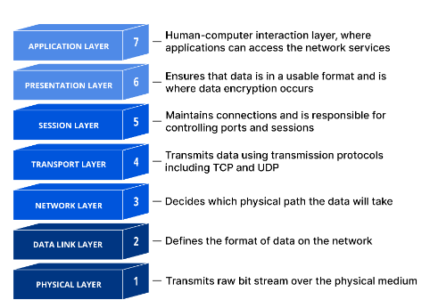

# Teknologi
---

## OSI modellen {#osi-modellen}

<figure markdown="span">
  { width="800" }
</figure>

Hvorfor er `OSI Modellen` vigtig?
For en datamatiker/programør er det vigtig at forstå OSI-modellen, da den:

*   Strukturer komplksiteten:
    * Deler netværksfunktioner i lag, hvilket gør det nemmere at fejlsøge og designe netværk.
*   Standardisere Kommunikation:
    * Sikrer, at forskellige systemer og enheder kan kommunikere effektivt.
*   Forbedre sikkerhed:
    * Hjælper med at identificere og afbøde sikkerhedstrusler på forskellige lag.

At have en grundlæggende forståelse af OSI-modellen gør det lettere at arbejde med netværksrelaterede programmeringsopgaver og forstå, hvordan data bevæger sig gennem et netværk.

OSI-modellen også kalder `Open Systems Interconnection Model`. Består af 7 lag.
Følgende huske regl kan anvendes:
**P**lease **D**o **N**ot **T**hrow **S**ausage **P**izza **A**way

### Physical layer: {#osi-physical-layer}
Data på dette lag er i form af bits 0 og 1-taller
Dette lag er ansvarlig for de specifikationerne af den fysisk hardware der bliver brugt til at kommunikere over netværket med.

Dette lag definere også standarden for kommunikation. Der arbejdes med tre typer af kommunikation.

*   Simplex - one way only
*   Half Duplex - two way, but only send or receive at a time
*   Full duplex - two way, send or receive at the same time

Eksempler på enheder der befinder sig i dette lag er

*   Hubs
*   Network interface cards
*   Repeaters

### Data Link Layer: {#osi-data-link-layer}
Bits modtaget fra det fysiske lag `(Physical Layer)` bliver transformerede til `frames` i Data Link Layer. Dette lag er ansvarligt for kommunikationen over lokale netværk `LAN - (Local Area Network)`. Det sørger for at organisere data i mindre enheder kaldet frames, hvilket gør det nemmere at håndtere og transmittere information effektivt.

En af de primære opgaver for Data Link Layer er `fysisk adressering`, bedre kendt som `MAC-adresser - (Media Access Control)`. Hver enhed, der kan tilsluttes et netværk, har en unik MAC-adresse, som sikrer, at data rammer den korrekte destination. For eksempel, når du sender en fil fra din computer til en printer på det samme netværk, bruger Data Link Layer MAC-adresser til at identificere både computeren og printeren, og sørger for, at filen bliver sendt til den rigtige enhed.

Derudover håndterer Data Link Layer `fejlkontrol - (error control)` og `flowkontrol - (flow control)`. Fejlkontrol sikrer, at eventuelle fejl, der opstår under transmissionen af data, bliver opdaget og rettet. Flowkontrol synkroniserer sendelse og modtagelse på netværket, så afsenderen ikke overvælder modtageren med for mange data på én gang. Dette er vigtigt for at sikre, at netværkstrafikken forbliver effektiv og uden tab af data.

Som et konkret eksempel, forestil dig at du sender en stor video fra din bærbare computer til en ven via Wi-Fi. Data Link Layer opdeler videoen i mindre frames og tilføjer en header, der inkluderer MAC-adressen for både din bærbare computer og din vens enhed. Under transmissionen overvåger Data Link Layer for fejl, og hvis der opdages en fejl, vil den forsøge at rette den eller anmode om genudsendelse af de korrupte frames. Samtidig sørger flowkontrol for, at din bærbare computer ikke sender data hurtigere, end din vens enhed kan modtage og behandle dem. Dette koordinerede samspil gør, at videoen bliver overført korrekt og effektivt.

Protokoller på Data Link Layer:

*   **Ethernet:** En af de mest anvendte teknologier til lokale netværks (LANs). Ethernet specificere, hvordan data skal pakkes ind i frames og adressers ved hjælp af MAC-adresser.
*   **Frame Relay:** En teknik til at sende data over brede netværk (WANs) ved at bruge et virtuelt kredsløb.
*   **Token Ring.** En netværksprotokol, hvor en token cirkulere i et ring-topologi netværk, og kun den enhed, der har tokenen, kan sende data.
*   **Fiber Distributed Data Interface (FDDI):** Bruges til at overfører data over fiberoptiske kabler i et LAN eller MAN - (Metropolitan Area Network). Det anvender en dobbelt ring-topologi for at sikre redudans og pålidelighed.
*   **Token Bus:** En netværksprotokol, hvor en token cirkulere i en bus-topologi, hvilket giver en retfærdig adgangsmetode til netværket.
*   **PPP (Point-to-point protocol):** Bruges til at etablere en direkte forbindelse mellem to noder og overfører data over serielle forbindelser som telefonlinjer.

Enheder på Data Link Layer:

*   Briges
    *   Enheder, der forbinder to eller flere netværk og filtrerer trafik for at reducere kollisionsdomøner ved at segmentere netværket. De opererer på MAC-adresse niveau.
*   Layer 2 Switches
    * Enheder, der opererer på Data Link Layer og bruger MAC-adresser til at videresende data til den korrekte port. De tilbyder bedre ydeevne og sikkerhed end simple hubs.

### Network Layer {#osi-network-layer}
Network Layer er ansvarlig for flere funktioner, der sikre, at data bliver leveret fra en kilde til en destination, uanset hvor de befinder sig i et netværk. 

*   **Pakkedannelse:** Når frames fra Data Link Layer når Network Layer, tilføjer Network Layer en header til hver frame. Denne proces kaldes `indkapsling`. Headeren indeholder vigtig information, såsom afsenderens og modtagerens IP-adresser. Når en fram får tilføjet en Network Layer header, bliver den til en `pakke`.
*   **Routing:** Newtwork Layer er ansvarlig for routing, hvilket betyder at bestemme den bedste vej for pakken at tage fra kilde til destinationen. Dette involvere brug af routingptotokoller som `OSPF - (Open Shortest Path First)`, `BGP - (Border Gateway Protocol)` og `RIP - (Routing Information Protocol)`. Routing gør det muligt for data at bevæge sig mellem forskellige netværk - (subnets), hvilket er essentielt for kommunikation i større netværk, herunder internettet.
*   **Fragmentering og Reassembly:** Newtwork Layer håndtere også `fragmentering` af pakker. Hvis en pakke er for stor til at blive sendt i én enkelt frame, `(baseret på MTU - Maximum Transmission Unit)`, bliver den opdelt i mindre fragmenter. Når disse fragmenter når destinationen, bliver de genskabt til den oprindelige pakke. Denne proces sikrer, at store mængder data kan transporteres effektivit over netværk med forskellige MTU-størrelser.
*   **Fejlhåndtering og Diagnostik:** Network layer kan også inkludere funktioner til fejlhåndtering og diagnostik. For eksempel bruges `ICMP - (Internet Control Message Protocol)` til at sende fejlinformation og udføre netværksdiagnostik som `Ping og Traceroute`.

Som et konkret eksempel, forstil dig, at du sender en e-mail fra din computer i Danmark til en ven i USA. Når du klikker på send, bliver e-mailen opdelt i dataenheder (frames) på Data Link Layer. Når disse frames når Network Layer:

1. Bliver hver frame til en pakke ved at tilføje en header, der indeholder din IP-adresse og din vens IP-adresse.
2. Netværksudtyr (som router) bruger denne information til at bestemme den bedste vej gennem internettet for at levere pakken til din vens computer.
3. Hvis nogen af pakkerne er for store til at passere gennem et netværkssegment, bliver de fragmenteret i mindre stykker.
4. Når alle pakkerne når destinationen, bliver de rekonstrueret til den oprindelige e-mail på din vens computer.

Protokoller på Network Layer:

* IPv4 - internet protocol version4:
    * Den mest anvendte protokol til at sende data over internettet. IPv4 bruger 32-bit adresser.
* IPv6 - internet protocol version 6:
    * Efterfølgereen til IPv4, som bruger 128-bit adresser for at håndtere det voksende antal internet-enheder.
* ICMP - internet control message protocol
    * Bruges til fejldiagnostik og kontrol, som f.eks. at sende fejlmeddelser og udfører netværksdiagnostik `(Ping og Traceroute)`.
* IPsec - internet protocol security:
    * En protokol suite, der sikrer IP-kommunikation ved at autentificere og kryptere hver IP-pakke i en datastream.
* OSPF - Open shorrtest path first:
    * En routing-protokol, der bruges til at finde den bedste vej for data gennem et IP-netværk.
* EIGRP - enhanced interior gateway routing protocol:
    * En avanceret distance-vector routing-protokol, der hjælper med at finde den optimale rute til data.

Enheder på Netværk Layer:

* Layer 3 Switches
    * Disse enheder kan udfører routing-funktioner ud over almindelig switching. De kan forwarde pakker baseret på IP-adresser, hvilket gør dem idelle til komplekse netværk.
* Routers
    * Grundlæggende enhed i et netværk, der bestemmer den bedste vej for at sende data mellem forskellige netværk baseret på IP-adresser.
* Firewalls
    * Sikkerhedsenheder, der overvåger og kontrollere netværkstrafik baseret på foruddefinerede sikkerhedsregler. De kan operer på flere lag, men typisk filtrerer de trafik baseret på IP-adresser og portnumre

### Transport Layer {#osi-transport-layer}
Når pakkerne fra Newtwork Layer kommer op på Transport Layer, bliver der tilføjert yderligere headers, og pakkerne bliver til `segments`. Trasport Layer er ansvarlig for en meget vigtig funktion, da det er dette lag, som definere `transport protocol`. En transportprotokol kan være `TCP` eller `UDP`.

**TCP (Transmission Control Protocol)**

*   Pålidelig og forbindelsesorienteret:
    * TCP etablere en forbindelse mellem afsender og modtager gennem `3-way-handshake`. Denne proces sikrer, at begge parter er klar til dataoverførsel.
*   Fejlkontrol, sekvensering og gendannelse:
    * TCP sørger for, at alle segmenter ankommer korrekt ved at nummerere dem og kvittere for modtagelsen. Hvis et segment går tabt, bliver det sendt igen.
*   Flowkontrol: 
    * TCP bruger mekanismer som `sliding window` for at kontrollere mængden af data, der sendes, før modtageren skal kvittere for dem. Dette forhindrer netværksbelastning.
*   Brugsscenarier
    * TCP er ideelt for applikationer, hvor dataenes integritet er kritisk, såsom webbrowsing `(HTTP/HTTPS)`, e-mail `(SMTP, IMAP)` og filoverførsel `(FTP)`.

**UDP (User Datagram Protocol)**

* Upålidlig og forbindelseløs:
    * UDP sender data uden at etablere en forbindelse og uden at sikre, at dataene når frem til destinationen.
* Ingen fejlkontrol eller flowkontrol:
    * UDP implementere ingen mekanismer til at kontrollere eller rette fejl i dataene, hvilket gør det lettere og hurtigere end TCP.
* Lav overhed og hurtig transmission:
    * På grund af den lave overhed er UDP velegnet til applikationer, hvor hastighed er vigtigere end pålidelighed, som f.eks. live video- og lydstreaming `(VoIP, IPTV)`, online gaming og DNS-opslag.
* Pakkehpntering
    * UDP-pakker `(datagrammer)` sendes uafhængigt af hinanden, hvilket betyder, at de kan ankomme i en anden rækkeføkge end de blev sendt.

Transport Layer er også ansvarlig for en vigtig funktion kaldet `process separation`. Denne funktion tillader flere programmer på sammen enhed at kommunikere samtidg ved hjælp af `port numbers`. Hver applikation får tildelt en unik portnummer, der brugres til at identificere den specifikke applikation på netværket.

* portnumre:
    * **well-known ports:** Disse er portnumre fra 0 til 1023 og bruges af velkendte protojoller som `HTTP - Port 80`, `HTTPs - port 443`, `FTP - port 21` og `SMTP - port 25`.
    * **Registered ports:** Disse porte er portnumre fra 1024 til 49151 og bruges af applikationer registreret hos `IANA - Internet Assigned Numbers Authority`. Det er en organisation der er ansvarlig for at koortinere nogle af de centrale elementer, der holder internettet kørende.
    * **Dynamic/Private ports:** Disse er portnumre fra 49152 til 65535 og bruges til dynamiske eller private forbindelser.

Som et konkret eksempel, forstil dig, at su streamer en live sportsbegivenhed online:

* TCP: hvis webstedet bruger TCP, sikre det, at hver del af videoen ankommer korrekt og i rækkefølge, men kan føre til `buffering`, hvis netværket er langsomt.
* UDP: hvis webstedet bruger UDP, får du en jævn streamingoplevelse uden buffering, men nogle dele af videoen kan gå tabt, hvilket kan resultere i mindlertidige udfald eller lavere kvalitet.

### Session Layer {#osi-session-layer}
Session Layer er ansvarlig for at etablere, administrere og afslutte sessioner mellem applikationer på forskellige enheder. Dette lag styrer dialogen mellem to kommunikerende enheder ved at organisere og synkronisere dataudvekslingen.

Funktioner i Session Layer:

* Etablering af Sessioner:
    * Session Layer starter og vedligeholder kommunikationssessioner mellem applikationer på to forskellige computere. En session kan beskrives som en tidsbegrænset forbindelse, hvor data kan udveksles.
* Kontrol og Vedligeholdelse af Sessioner:
    * Dette lag styrer dialogen ved at fastlægge, hvilken side der kan sende data på et givet tidspunkt, hvilket kaldes dialogkontrol. Det kan understøtte både `fuld duplex (samtidig tovejskommunikation)` og `halv duplex (vekselvis tovejskommunikation)`.
* Synkronisering:
    * Session Layer bruger synkroniseringspunkter, også kendt som `checkpoints` eller `synk points`, for at sikre, at data kan gendannes i tilfælde af en afbrydelse. Hvis en session afbrydes, kan transmissionen genoptages fra det sidste synkroniseringspunkt i stedet for fra starten.
* Sekvenskontrol:
    * Ved brug af sekvensnumre kan Session Layer spore dataenhederne og sikre, at de ankommer i den korrekte rækkefølge. Dette hjælper med at organisere data, så applikationerne får den rigtige sekvens af meddelelser.

Protokoller i Session Layer:

* NetBIOS (Network Basic Input/Output System):
    * NetBIOS er en API, der giver applikationer på forskellige computere mulighed for at kommunikere i et `lokalnetværk (LAN)`. Det håndterer session og transporttjenester såsom navnefortolkning og datatransmission.
* SOCKS (Socket Secure): 
    * SOCKS er en internetprotokol, der ruter netværkspakker mellem klient og server gennem en `proxyserver`. Det kan bruges til at omgå firewalls og maskere brugernes IP-adresser.
* NFS (Network File System):
    * NFS tillader en computer at få adgang til filer over et netværk, som om de var på dens lokale diske. Session Layer håndterer etablering, vedligeholdelse og afslutning af filoverførselsessioner.

Som konkret eksempel på Session Layer
Forestil dig, at du deltager i en online videokonference:

* Etablering af Session:
    * Når du deltager i videokonferencen, etablerer Session Layer en session mellem din computer og serveren, der hoster konferencen.
* Kontrol og Vedligeholdelse af Session:
    * Session Layer styrer, hvornår du kan tale og hvornår du kan modtage data (video og lyd), ved at styre dialogen mellem din computer og serveren.
* Synkronisering:
    * Under konferencen kan synkroniseringspunkter sættes, så hvis forbindelsen afbrydes, kan sessionen genoptages fra det punkt, hvor den blev afbrudt, i stedet for at starte forfra.
* Sekvenskontrol:
    * Ved brug af sekvensnumre sørger Session Layer for, at video- og lydpakkerne ankommer i den rigtige rækkefølge, hvilket sikrer en korrekt og sammenhængende afspilning.

Session Layer spiller en kritisk rolle i netværkskommunikation ved at sikre, at applikationer kan opretholde en pålidelig og organiseret forbindelse. Dette lag er især vigtigt i komplekse netværksapplikationer, hvor kontinuitet og rækkefølge af data er afgørende for korrekt funktionalitet.

### Presentation Layer {#osi-presentation-layer}
Presentation Layer er ansvarlig for datarepræsentation, konvertering og kruptering, hvilket sikrer, at data sendes fra afsenderen i et format, som modtageren kan forstå. Dette lag fungere som et oversætterlag mellem applikationer og netværk.

Funktioner i presentation layer:

1. Datarepræsentation og Konvertering:
    * Presentation Layer håndtere konvertering af data mellem forskellige formater. Dette sikrer, at data kan forstås på tværs af forskellige systmer og applikationer. Eksempler på dataformater inkludere:
        * ASCII - American Standard Code for Information Interchange
        * EBCDIC - Extended Binary Code Decimal Interchange Code
        * JPEG  Joint Photographic Experts Groups - for billeddata
        * MPEG - Moving Picture Experts Group - for videodata
2. Kryptering og Dekruptering:
    * Her sikres datasikkerhed ved at kryptere data før transmission og dekryptere data ved modtagelse. Kryptering beskytter data mod uautoriseret adgang under transmissionen.
3. Komprimering og Dekompressering:
    * Presentation Layer komprimere data for at reducere båndbreddeforbruget under transmission. Ved modtagelse dekomprimeres data for at gendanne deres oprindelige format. Dette er især nyttigt til mediefiler som billeder, video og lyd.

Som konkret eksempel:
Forstil dig, at su sender en JPEG-billedefil via e-mail

1. Datarepræsentation:
    * Presentation Layer konvertere billedet til JPEG-format, som modtagerens system kan forstå.
2. Kryptering:
    * For at beskytte billedet under tensmissionen krypteres der.
3. Komprimering:
    * Billedet komprimeres for at minimere båndbreddeforbruget.
4. Dekryptering og Dekompressering:
    * Ved modtagelse dekrypteres og dekomprimeres billedet, og det konverteres tilbage til det oprindelige format for visning.

### Application Layer {#osi-application-layer}
 Application Layer er det øverste lag i OSI-modellen, der fungere som grænsefladen mellem applikationerne og netværket. Det levere netværkstjenester direkte til applikationerne og brugerne.

 Funktioner i Application Layer:

 1. Netværkstjenester og Protokoller:
    * Application Layer tilbyder forskellige tjenester og protojoller, som tillader applikationer at kommunikere med netværket. Nogle almindelige protojoller inkluderer:
        * DNS - domain name system: Konverterer domænenavne til IP-adresser.
        * HTTP - HyperText Transfer Protocol: Bruges til overførsel af webindhold.
        * FTP - File Transfer Protocol: Bruges til filoverførsler mellem klient og server.
        * SMTP - Simple Mail Transfer Protocol: Bruges til e-mail transmission.
        * POP3/IMP: Bruges til hentning af e-mails fra en server
 2. Tjenester til Brugerapplikationer:
    * Dette lag leverer funktionalitet, som gør det muligt for brugerapplikationer at anvende netværkstjenester. Det giver brugergrænseflader `(GUI'er)` til applikationer som webbrowsere, e-mail-klienter og filoverførselsprogrammer.
 3. Funktionalitet og Produktivitet:
    * Application Layer spiller en central rolle i at levere funktionalitet, produktivitet og brugervenlighed i netværksmiljøet. Det giver brugerne adgang til forskellige applikationer og tjenester, som de bruger til at udføre deres opgaver.

Som konkret eksempel:
Når du besøger en hjemmeside ved hjælp af en webbrowser:

1. DNS: Browseren bruger DNS til at kovertere webadressen til en IP-adresse.
2. HTTP: Browseren bruger HTTP til at anmode om websidens indhold fra webserveren.
3. FTP: hvis du downloader en fil fra hjemmesiden, kan FTP anvendes til at overføre filen til din computer.

## Trusselsmodellering {#trusselsmodellering}
Trusselsmodellering er en proces, hvor potentielle trusler mod et system identificeres, forstås og prioriteres. Denne proces hjælper med at afdække sikkerhedsrisici tidligt i udviklingsprocessen, hvilket gør det muligt at implementere passende sikkerhedsforanstaltninger. For at kunne gennemføre en effektiv trusselsmodellering skal man forstå systemets arkitektur og de interaktioner, der finder sted mellem dets forskellige komponenter.

Se afsnittet [overordnet arkitektur](programmering.md#overordnet-arkitektur) under programmering.

### Abuse Cases baseret på Use Cases {#teknologi-abuse-cases}
Use cases beskriver, hvordan brugeren interagere med systemet for at opnå et specifikt mål. `Abuse Cases` er derimod scenarier, hvor en `angiber / ondsindet aktør` udnytter systemet. Ved at analysere abuse cases kan systemet forbedres på at forsvare sig mod disse angreb.

Eksempel på use case og tilførende abuse case:

* Use Case: En bruger ligger ind på systemet for at få adgang til sin data og se sin samling af baner.
* Abuse Case: En angriber forsøger at logge ind ved hjælp af brute force eller stjålne legitimationsoplysninger.

se afsnittet [Tilføjelse ved xp](extreamProgramming.md#tilføjelse-ved-xp) for flere eksempler på abuse cases til det udviklede system i projekt `RallyObedience`.

### Risikoanalyse {#teknologi-Risikoanalyse}
Risikoanalyse involvere vurdering af sandsynligheden for forskellige trusler samt deres potentielle konsekvenser. Formålet er at prioritere trusler baseret på deres risiko og derefter træffe beslutninger om, hvilke sikkerhedsforanstaltninger der skal implementeres.

I system `RallyObedience` kan vi gennemføre en risikoanalyse ved at identificere truslerne for hver use case, men også for hver komponent der indgår i det distribuerede system og vurdere deres risiko:

1. Frontend (Klient - Browser med Blazor)
    * Trusler: 
        * Cross-Site Scripting `XSS`
        * Man-in-the-Middle `MitM`
    * Sikkerhedsforanstaltninger:
        * Blazor encoder output automatisk for at beskytte mod XSS.
        * Brug af HTTPS forhindre MitM angreb ved at sikre kryptering.

2. Backend (API-server)
    * Trusler:
        * Denial of Service `Dos` angreb. Uatoriseret adgang, datainterception.
    * Sikkerhedsforanstaltninger:
        * Rate limiting for at fordinre Dos
        * Authentication og Authorization for at beskytte mod uatoriseret adgang
        * Kryptering af data i transit, input validering og firewalls

3. 
    * Trusler:
        * Uatoriseret adgang
        * `Datatab`
        * `SQL-injektion`
    * Sikkerhedsforanstaltninger:
        * Reglmæssige backups for at forhindre datatab
        * Adgangskontrolmekanismer (Identity)
        * Brug af prepared statements eller Stored procedures for at beskytte mod SQL-injektion

#### Identificering af Arbejdsprocesser og Aktiver
For at sikre en effektiv trusselmodellering og risiko analyse er det vigtigt at identificere de forskellige arbejdsprocesser og aktiver i systemet:

arbejdsprocesser:

* Autentifikation og Autorisation: Håndtering af brugerlogin og adgangskontrol
* Datahåndtering: Opslag, opdatering og lagring af data
* Kommunikation: udveksling af data mellem klient og server

Aktiver:

* Brugeroplysninger: Personlige data, loginoplysninger
* Systemdata: Bane designs, kommentarer, chatbeskeder
* Kommunikationskanaler: HTTPS-forbindelser mellem klient og server
* API-Endpoints: Funktioner til databehandling og -hentning

### CIA-Triaden {#teknologi-CIA}
CIA-Triaden er en fundamental sikkerhedsmodel, der bruges inden for trusselsmodellering til at evaluere og sikre sytemer. 
Den består af tre nøgleprincipper:

1. Confidentiality `Fortrolighed`
2. Integrity `Integritet`
3. Availability `Tilgængelighed`

#### Confidentiality - Fortrolighed
Fortrolighed sikrer, at information kun er tilgængelig for autoriserede personer og systemer. Dette beskytter data mod uatoriseret adgang og afsløring. I trusselsmodellering handler det om at identificere og beskytte data, der kan være følsomme, såsom brugeroplysninger og kommunikation.

Eksempler på sikkerhedsforanstaltninger:

* Kryptering af data i hvile og under transmission
* Implementering af adgangskontrolmekanismer som autentifikation og autorisation
* Brug af sikre kommunikationsprotokoller som HTTPS

#### Integrity - Integritet
Interitet sikrer, at information ikke kan ændres eller sltees på en uatoriseret måde. Det handler om at beskytte data mod manipulation og sikre, at de forbliver nøjagtige og konsistent.

Eksempler på sikkerhedsforanstaltninger:

* Brug af hash-funktioner og digitale signaturer for at sikre dataintegritet.
* Implementering af input validering for at beskytte mod angrab som SQL-injektion.
* Logging og overvågning af systemaktiviteter for at opdage og reagere på uatoriserede ændringer.

#### Availability - Tilgængelighed
Tilgængelighed sikre, at information og systmer er tilgængelige for autoriserede brugere, når de har brug for det. Dette handler om at beskytte systemet mod angreb og fejl, der kan forårsage nedetid eller forhindre brugere i at få adgang til de nødvendige ressourcer.

Eksempler på sikkerhedsforantaltninger:

* Implementering af redundans og failover-mekanismer
* Beskyttelse mod DoS angreb gennem rate limiting og firewalls
* Reglmæssige sikkerhedskopier for at sikre data tilgængelighed i tilfælde af systemfejl.

### STRIDE {#teknologi-STRIDE}
`STRIDE` er en metode udviklet af Microsoft til systematisk identifikation og kategorisering af sikkerhedstrusler i software og informationssystemer. 
Det står for seks kategorier af trusler:

1. Sppofing
    * En angriver udgiver sig for at være en anden bruger eller en enhed for at få uatoriseret adgang til et system.
2. Tampering
    * En angriber ændrer data eller kode i systemet, enten under transmission eller i hvile
3. Repudiation
    * Også kalder afvisning - En bruger nægter at have udført en handling, og systemet har ikke tilstrækkelig beviser til at modbevise denne påstand.
4. Information Discolosure
    * Uatoriseret adgang til information, der burde være beskyttet
5. Denial og Services DOS
    * Et angreb, der forhindre legitime brugere i at få adgang til systemet eller dets ressourcer.
6. Elevation of Privilege
    * En brugere opnår højere adgangsrettigheder end autoriseret, hvilket giver dem mulighed for at udføre handlinger, de normalt ikke har adgang til.

STRIDE bruges til at gennemgå systemets forskellige dele og identificere potentielle trusler inden for hver kategori. Ved at analysere truslerne på denne måde kan udviklere og sikkerhedsspecialister:

* Systematisk identificere trusler:
    * ved at anvendes STRIDE-modellen sikres det at alle relevante typer af trusler overvejes.
* Forstå truslers natur:
    * Kategoriseringen hjælper med at forstå, hvilke type trusler systemet står overfor, og hvorfan de kan manifestere/opstå.
* Prioritere sikkerhedsforanstaltninger / sikkerhedskrav
    * Ved at forstå truslernes type og konsekvens kan man prioritere indsatsen på at beskytte systemet mod de mest alvorlige trusler.
* Dokumentere sikkerhedsarbejde:
    * STRIDE-modellen giver en struktureret tilgang til at dokumentere trusselsidentifikation og de tilførende afbødende foranstaltninger.

